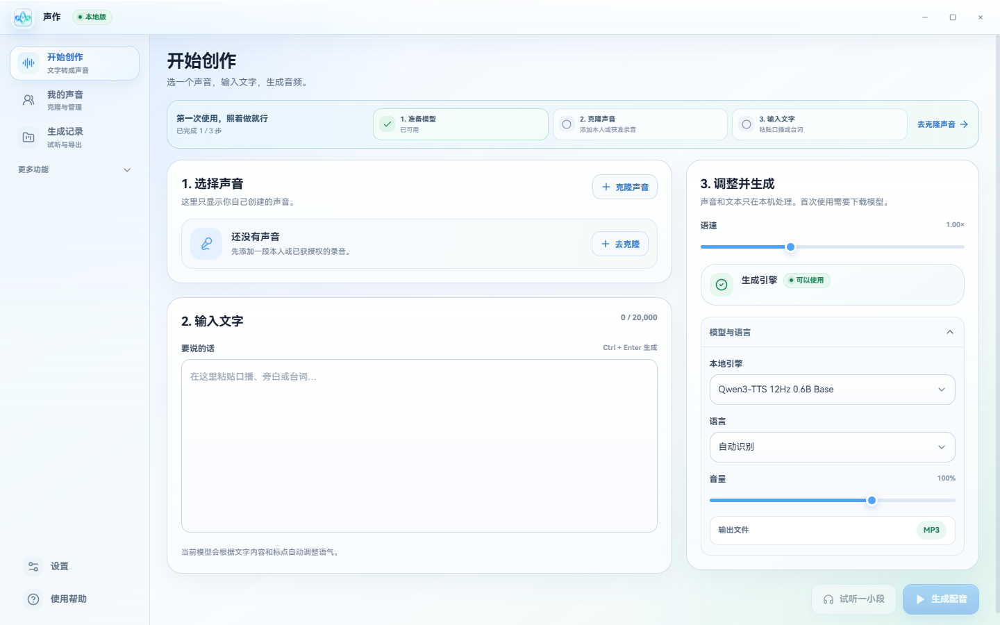

<p align="center">
  
</p>

# 声作

> 让自己的声音，成为作品。

声作是一款 Windows 本地声音创作工作台。导入一段录音并输入文字，即可在本机完成真实声音克隆、配音、试听和 MP3 导出。没有账号、会员、支付、遥测或云端语音服务。



## 一分钟开始

1. 完整解压轻量 ZIP，或直接复制“含三模型完整便携版”文件夹。
2. 双击 `启动.cmd`。
3. 打开“本地引擎”，不知道选哪个就下载 VoxCPM2。
4. 打开“我的声音”，点击选择或直接拖入 3–60 秒清晰录音，再填写录音原文。
5. 回到“开始创作”，选择语言或方言，输入文字并导出 MP3。

轻量版会一键下载、校验并安装模型、隔离 Python、FFmpeg 和官方权重，不要求用户操作命令行。含三模型版已经准备好全部运行文件，打开即可使用。
下载前会检查磁盘空间，下载中显示速度和剩余时间；中断后可续传，官方源较慢时可切换备用源，也可从其他设备导入已准备好的完整模型目录。

软件会自动检测 NVIDIA 显卡、驱动和显存。显卡条件合适时自动使用 CUDA；没有合适显卡时自动切换 CPU，不要求单独安装 CUDA Toolkit。CPU 模式建议至少 16GB 内存，速度会慢一些。

## 三款模型怎么选

| 模型                | 推荐度 | 突出特点                                                       | 推荐场景                     | 首次占用 |
| ------------------- | -----: | -------------------------------------------------------------- | ---------------------------- | -------: |
| VoxCPM2             |    5.0 | 综合最推荐；真实克隆、情绪、声音设计；30 种语言与 9 种中文方言 | 大多数口播、旁白和创作       | 约 15 GB |
| Fun-CosyVoice3 0.5B |    4.5 | 更多中文方言；提供 19 种方言/口音选择                          | 方言内容、口音控制和中文长稿 | 约 16 GB |
| IndexTTS-2.5        |    4.8 | 情绪演绎、五种语言与发音控制                                   | 细腻语气、多语言和指定发音   | 约 18 GB |

语言菜单会显示全部选项。当前模型不支持的选项带锁，鼠标移到锁上会提示需要切换的模型。声作默认只加载一个大模型，切换时自动释放上一个。

首次下载前可以选择保存位置；未选择时默认保存在 `%LOCALAPPDATA%\声作模型库`。程序升级不会删除，设置中可以打开或迁移整个模型库；退出声作后也可直接删除不用的整个模型目录。

含三模型便携版会直接使用旁边的 `模型库` 文件夹，不会先复制几十 GB。需要长期固定保存时，运行包内的 `安装到本机模型库.cmd` 即可复制到上述通用位置。

## 主要能力

- 单段文字配音，控制语言、方言、表达、语速和音量。
- 字幕配音：导入 SRT/TXT，逐句修改后用同一个声音生成并合成完整音轨。
- 为对话稿分配多个声音并合成长音频。
- 保存完整配音项目，保留稿件、声音、模型、参数和每句状态，之后可直接继续。
- 长字幕逐句缓存；失败、取消或重启后保留已完成句子，只重做失败或修改过的句子。
- 后台任务队列按顺序处理多份配音，不必停留在生成页面等待。
- 按日期查看生成记录，支持试听、收藏、删除和另存为 MP3。
- 自定义导出文件名规则；项目、日期、时间、类型和模型可自由组合，导出时仍可临时改名，并记住上次规则和文件夹。
- 一键下载、暂停、续传、切换下载源、离线导入和管理三款本地模型。
- 选择或从资源管理器拖入克隆录音时，自动检查格式、时长、音量和爆音，并提醒录音原文与时长明显不匹配。
- 设置页一键检查并修复本地后台、模型运行环境、FFmpeg、文件权限和硬件配置。
- 设置页一键导出脱敏诊断 ZIP，方便在其他电脑排查问题。

## 启动方式

- `启动.cmd`：唯一入口，窗口打开后命令行自动退出。
- 启动器携带 Electron 运行时，不依赖系统 Node.js。

## 开发与验收

```powershell
pnpm dev
pnpm format:check
pnpm lint
pnpm typecheck
pnpm test
pnpm test:interaction
pnpm build
pnpm package:win
pnpm visual:capture
```

开发预览使用 `pnpm dev`，Renderer 支持热更新。Renderer 保持 `contextIsolation: true`、`nodeIntegration: false` 与 `sandbox: true`；本地 Worker 只绑定环回地址并使用一次性启动令牌。

生成完整便携包：

```powershell
powershell -NoProfile -ExecutionPolicy Bypass -File scripts/create-share-package.ps1
```

在本机三款模型均已安装后，生成可直接拷贝的含模型文件夹：

```powershell
powershell -NoProfile -ExecutionPolicy Bypass -File scripts/create-complete-package-with-models.ps1
```

完整隐私、支持、架构、许可和进度说明见 [PRIVACY.md](PRIVACY.md)、[SUPPORT.md](SUPPORT.md)、[docs/architecture.md](docs/architecture.md)、[docs/license-audit.md](docs/license-audit.md) 与 [docs/progress.md](docs/progress.md)。
