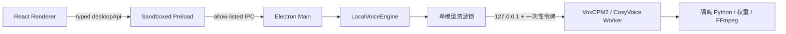

# 技术架构

## 总览

Renderer 没有 Node 权限，也不接触模型路径或 Worker 令牌。窗口、文件系统、模型下载、进程管理、导出、硬件检测和诊断均由 Electron 主进程负责。

## 目录职责

| 目录                     | 职责                                                       |
| ------------------------ | ---------------------------------------------------------- |
| `apps/desktop`           | Electron main/preload、严格 IPC 与 React 界面              |
| `packages`               | 类型、UI、引擎协议、音频、下载与硬件公共包                 |
| `engines/common`         | 隔离运行时、固定版本资源安装、CosyVoice 通用服务与音频合并 |
| `engines/voxcpm2`        | VoxCPM2 独立清单、许可与 Worker                            |
| `engines/fun-cosyvoice3` | Fun-CosyVoice3 独立清单、许可与 Worker                     |
| `engines/indextts2-5`    | IndexTTS-2.5 独立清单、许可与 Worker                       |
| `engines/mock`           | 仅视觉预览和自动化状态                                     |

## 安全与生命周期

- `contextIsolation: true`、`nodeIntegration: false`、`sandbox: true`。
- Worker 只绑定 `127.0.0.1` 随机端口，拒绝外部 Host、Origin 与远端地址。
- 每次启动使用 256 位一次性令牌，首次握手后换为仅存内存的会话令牌。
- 三个模型分别拥有 runtime、sources、weights、cache、outputs 与原子安装收据。
- 官方 revision 固定；关键文件在启用前校验 SHA-256。
- 默认一次只安装一个任务、加载一个大模型，切换前释放旧 Worker。

状态流：`not-installed → downloading ⇄ download-paused → installing → loading → ready → generating → success`。失败可重试，取消进入 `stopped`。

模型默认位于 `%LOCALAPPDATA%\声作模型库\<plugin-id>`，也可在首次下载前选择其他位置。当前模型库根目录以原子配置单独保存；设置中的迁移操作会先释放 Worker、检查空间、复制并核对文件清单，再切换配置和清理旧目录。模型与程序、生成记录分开，应用重新获得焦点时检查安装收据，因此手动删除模型目录后会自动恢复“未安装”。

单段、字幕与对话共用类型化命令。批量片段顺序生成后由独立脚本合并；结果元数据原子写入，Renderer 只通过白名单音频协议读取结果。

轻量便携 ZIP 只携带三个模型插件和通用组件，不携带模型权重、运行时、私人录音或生成结果。含三模型完整便携版会在旁边附带独立 `模型库`，`启动.cmd` 通过 ASCII 标记自动定位，不先复制大文件；两种版本都只保留这一个入口，且都不包含私人录音、生成结果或任务数据。
